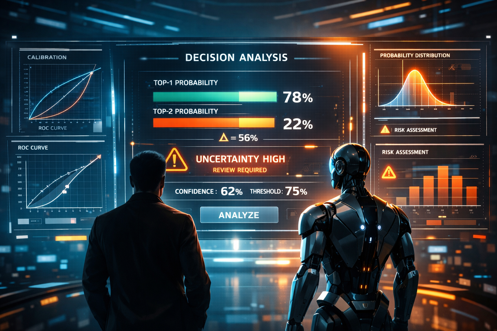

# decision-ml-under-uncertainty

<p align="center">
  
</p>


> **De métricas a decisiones. De modelos a sistemas gobernados.**  
> Una guía práctica y conceptual para construir sistemas de machine learning que sepan **cuándo decidir** y **cuándo no**.

---

## 🚀 ¿De qué trata este repositorio?

`decision-ml-under-uncertainty` es un **repositorio educativo y metodológico** diseñado para explicar — paso a paso — cómo construir **sistemas de machine learning responsables**.

No modelos que maximizan una métrica.  
No notebooks llenos de gráficos sin significado operativo.

Sino sistemas que:
- entienden el **riesgo**,
- manejan la **incertidumbre de forma explícita**,
- y toman decisiones alineadas con **consecuencias del mundo real**.

Este repositorio recorre **todo el ciclo de vida**:
desde la definición del problema y el análisis de datos  
hasta el entrenamiento del modelo, la calibración, los thresholds, la incertidumbre (CeRTS) y la gobernanza en producción.

---

## 🎯 Filosofía central

Algunos principios guían todo lo que encontrarás aquí:

- Un **modelo no toma decisiones** — produce señales.
- Las métricas **no equivalen a confianza**.
- La accuracy puede ser **peligrosa** si se interpreta de forma ingenua.
- Los thresholds son **políticas de negocio**, no perillas técnicas.
- La incertidumbre debe **medirse, no ignorarse**.
- A veces, la decisión más inteligente es **no decidir**.

Este proyecto está construido para hacer estas ideas concretas, ejecutables y enseñables.

---

## 🧠 ¿Qué aprenderás?

A lo largo de una serie estructurada de notebooks, aprenderás a:

- Definir problemas de ML desde una **perspectiva de decisión y riesgo**
- Entender los datasets como **representaciones imperfectas de la realidad**
- Separar **scores**, **probabilidades** y **decisiones**
- Usar la accuracy correctamente — y saber cuándo engaña
- Leer y razonar con matrices de confusión
- Elegir entre precision y recall según el costo del error
- Ajustar y justificar thresholds
- Calibrar probabilidades para que realmente signifiquen algo
- Cuantificar ambigüedad usando **CeRTS (delta top-1 / top-2)**
- Construir políticas de decisión bajo incertidumbre
- Pensar en **producción, drift y gobernanza**

Todo esto utilizando **datasets académicos reales**, no ejemplos de juguete.

---

## 📚 Estructura del repositorio

```text
decision-ml-under-uncertainty/
│
├── notebooks/
│   ├── 01_problem_risk_and_decisions.ipynb
│   ├── 02_data_reality_and_bias.ipynb
│   ├── 03_models_produce_signals.ipynb
│   ├── 04_metrics_are_not_decisions.ipynb
│   ├── 05_precision_recall_and_thresholds.ipynb
│   ├── 06_probability_calibration.ipynb
│   ├── 07_uncertainty_and_certs.ipynb
│   ├── 08_decision_policies_under_uncertainty.ipynb
│   └── 09_production_and_governance.ipynb
│
├── datasets/
│   ├── raw/
│   │   ├── winequality-red.csv
│   │   └── winequality-white.csv
│   └── processed/
│
├── scripts/
│   ├── plotting_style.py
│   ├── metrics_utils.py
│   └── certs_utils.py
│
├── config/
│   └── plot_style.yml
│
├── requirements.txt
└── README.md
